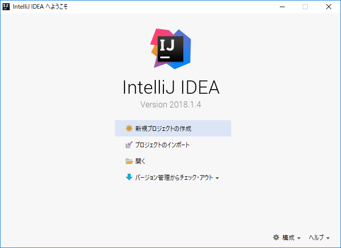
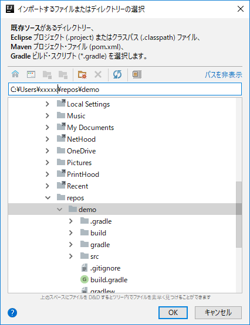
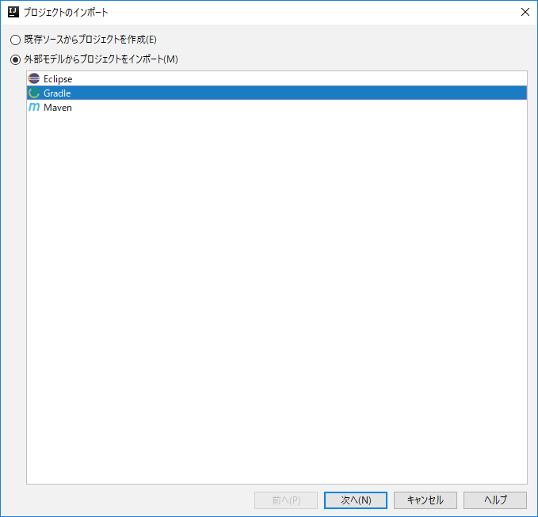
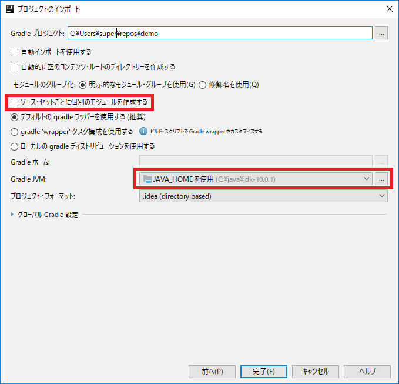
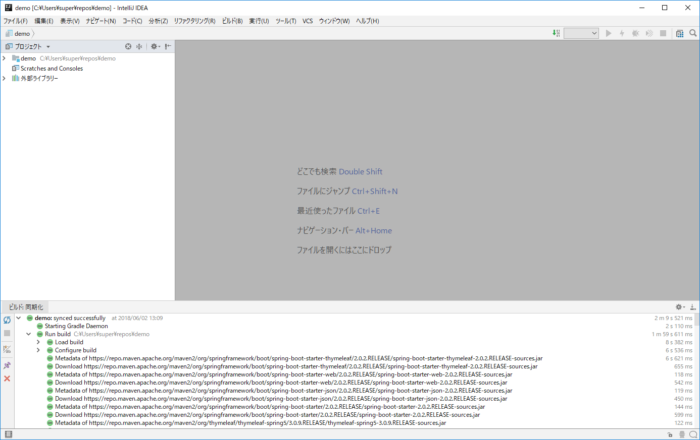
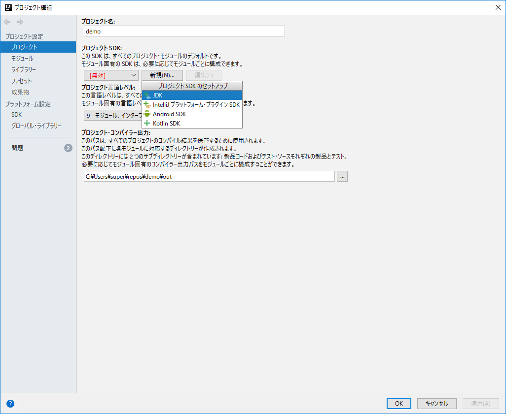

# IntelliJ IDEAへの取り込み

本章では、Spring Initializrで生成したGradleプロジェクトをIntelliJ IDEAに取り込み、
開発が実施できるようにします。

# IntelliJ IDEAで開く

1. スタートメニューからIntelliJ IDEAを開く。
1. 「IntelliJ IDEAへようこそ」画面が表示されたら、「プロジェクトのインポート」をクリックする。

    

1. 「インポートするファイルまたはディレクトリーの選択」画面で、
「C:\Users\xxxxx\repos\demo」を選択し、「OK」ボタンを押す。

    

1. 「プロジェクトのインポート」画面で「外部モデルからプロジェクトを
インポート」を選び、「Gradle」を選んで「次へ」ボタンを押す。

    

1.　「プロジェクトのインポート」画面で、以下の通り設定し、「完了」ボタンを押す。

    - 「ソース・セットごとに個別のモジュールを作成する」のチェックを外す
    - 「Gradle JVM」を「JAVA_HOMEを使用」に変更する

    

1. IntelliJ IDEAの画面が開く。「今日のヒント」画面が出るので、適宜読みつつ、「閉じる」ボタンを押す。

    ※ここで「このアプリの機能のいくつかがWindows Defenderファイアウォールで
    ブロックされています」という画面が表示された場合、以下の内容であることを
    確認して「アクセスを許可する」ボタンを押してください。
              
    - 名前: IntelliJ IDEA
    - 発行元: JetBrains s.r.o.
    - パス: C:\program files\jetbrains\intellij idea community edition 2018.1.4\bin\idea64.exe
    
    

## プロジェクトSDKの設定

1. メニュー「ファイル＞プロジェクト構造」を開き、左ペインで「プロジェクト」を選択する。
1. 「プロジェクトSDK」で「新規」ボタンを押し、表示される「プロジェクトSDKのセットアップ」
メニューから「JDK」を選ぶ。

    

1. 「JDKのホーム・ディレクトリー選択」画面で、「C:\java\jdk-10.0.1」を選び、「OK」ボタンを押す。
1. 「プロジェクト構造」画面に戻るので、「OK」ボタンを押す。

    ※プロジェクトSDKの設定後、しばらくの間、ウィンドウ最下部に「索引付け中」と表示される。
    索引付けが終わるまでは、コンパイルエラーが発生し、ソースコードに赤色の下線が引かれるなど
    するが、索引付けが終われば解消される。

## IntelliJ IDEAからの動作確認

1. 左ペイン（プロジェクトウィンドウ）で「demo/src/main/java/com/example/demo/DemoApplication」を
右クリックし、「実行(U) 'DemoApplication.main()'」をクリックする。

    （注）「com/example/demo」部分は「com.example.demo」と1階層に集約されて
    表示される。

1. 画面下部に実行ウィンドウが表示され、Spring Bootの起動メッセージ
（前章でGradleからbootRunを実行したときと同じメッセージ）が表示される。

    ```
    2018-06-02 13:23:07.128  INFO 8184 --- [           main] com.example.demo.DemoApplication         : 
    Started DemoApplication in 3.987 seconds (JVM running for 11.289)
    ```

1. 以下のメッセージが表示されたら、ブラウザーで
[http://localhost:8080/](http://localhost:8080/)
を表示し、さきほど同様「Whitelabel Error Page」が表示されることを確認する。


