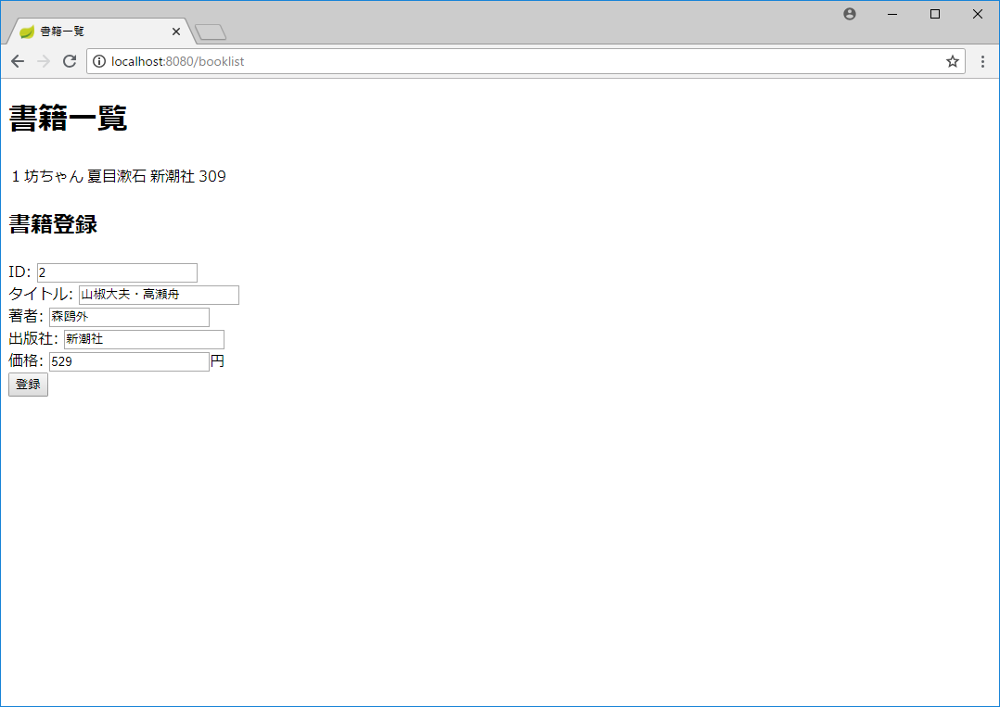

# JavaプログラムからCosmos DBにアクセスする

本章では、Javaプログラム（Spring Bootアプリケーション）から
Cosmos DBへのアクセス（データ登録、一覧取得）を扱います。

まず、書籍情報の登録処理で、要求を受け付けた際、Cosmos DBに登録する
処理を実装します。

この実装が終わった段階で一度アプリケーションを実行し、Azure Portalで
データが登録されていることを確認します。

続いて、書籍情報の一覧取得処理を実装し、さきほど登録したデータが
一覧表示画面に出力されることを確認します。

# Spring Data Cosmos DBライブラリーの追加

最初に、Spring BootアプリケーションからCosmos DBにアクセスするために
使用する、[Spring Data Cosmos DB](https://github.com/Microsoft/spring-data-cosmosdb)
ライブラリーへの依存関係を、Gradleスクリプト（build.gradle）に登録します。

具体的には、以下の通り、dependencies { ～ }の中に当該ライブラリーの
行を追加します。

```
dependencies {
	compile('org.springframework.boot:spring-boot-starter-thymeleaf')
	compile('org.springframework.boot:spring-boot-starter-web')
    compile('com.microsoft.azure:spring-data-cosmosdb:2.0.3')
	testCompile('org.springframework.boot:spring-boot-starter-test')
}
```

※「compile('com.microsoft.azure:spring-data-cosmosdb:2.0.3')」の1行が
今回追加した行です。

以下の内容が、現時点でのbuild.gradleの全体となります。

```
buildscript {
	ext {
		springBootVersion = '2.0.2.RELEASE'
	}
	repositories {
		mavenCentral()
	}
	dependencies {
		classpath("org.springframework.boot:spring-boot-gradle-plugin:${springBootVersion}")
	}
}

apply plugin: 'java'
apply plugin: 'eclipse'
apply plugin: 'org.springframework.boot'
apply plugin: 'io.spring.dependency-management'

group = 'com.example'
version = '0.0.1-SNAPSHOT'
sourceCompatibility = 1.8

repositories {
	mavenCentral()
}


dependencies {
	compile('org.springframework.boot:spring-boot-starter-thymeleaf')
	compile('org.springframework.boot:spring-boot-starter-web')
	compile('com.microsoft.azure:spring-data-cosmosdb:2.0.3')
	testCompile('org.springframework.boot:spring-boot-starter-test')
}
```

build.gradleの編集を終えたら、画面右下に「Gradleプロジェクトを
インポートする必要があります」と表示されるので、「変更をインポート」を
クリックします。


# 書籍情報の登録処理

## リポジトリーインターフェースの作成

1. 「com.example.demo」の下に「repository」パッケージを作成する。
1. 「repository」パッケージの下に「BookInfoRepository」インターフェースを作成する。
インターフェースの作成は、プロジェクトウィンドウで「repository」パッケージを右クリックし、
「新規＞Javaクラス」を選び、名前「BookInfoRepository」、種類「Interface」と
入力して「OK」ボタンを押して行う。
1. BookInfoRepositoryインターフェースを以下の通り修正する。

    ```
    package com.example.demo.repository;
    
    import com.example.demo.model.BookInfo;
    import com.microsoft.azure.spring.data.documentdb.repository.DocumentDbRepository;
    import org.springframework.stereotype.Repository;
    
    @Repository
    public interface BookInfoRepository extends DocumentDbRepository<BookInfo, String> {
    }
    ```
    
    修正のポイントは以下の3点。
    - インターフェースに @Repository アノテーションを付与する
    - DocumentDbRepositoryインターフェースを拡張する
    - DocumentDbRepositoryの型引数（<>の中に指定した型の情報）として、データモデルの型（BookInfoクラス）とID項目の型（String）を指定する

## モデルクラスの修正

1. 以下の通り、モデルクラス（BookInfo）に @Document アノテーションを付与し、
Cosmos DBのコレクションとの関連付けを行う。

```
import com.microsoft.azure.spring.data.documentdb.core.mapping.Document;

@Document(collection = "book_info")
public class BookInfo {

    public BookInfo() {
    }

    public BookInfo(String id, String title, String author, String publisher, int price) {
        this.id = id;
        this.title = title;
        this.author = author;
        this.publisher = publisher;
        this.price = price;
    }
（以下略）
```

## コントローラークラスの修正

次に、コントローラークラスを修正し、書籍情報登録処理が呼ばれた際に
上で作成したリポジトリーを使用してCosmos DBに登録する処理を実装します。

1. BookListControllerクラスのフィールドにリポジトリーを追加し、
Dependency Injectionのため @Autowired アノテーションを付与する。
    
    ```
    package com.example.demo.web;
    
    import com.example.demo.model.BookInfo;
    import com.example.demo.repository.BookInfoRepository;
    import org.slf4j.Logger;
    import org.slf4j.LoggerFactory;
    import org.springframework.beans.factory.annotation.Autowired;
    （中略）
    
    @Controller
    @RequestMapping("/booklist")
    public class BookListController {
    
        private static final Logger LOGGER = LoggerFactory.getLogger(BookListController.class);
        
        @Autowired
        private BookInfoRepository repository;
    （以下略）
    ```

1. registerBookInfoメソッドにCosmos DBにアクセスする処理を追加する。
具体的には、以下の通り当該メソッドを修正する。
    
    ```
        @PostMapping(path = "register")
        public String registerBookInfo(BookListForm form, BindingResult result, Model model) {
            LOGGER.info(form.toString());
            
            BookInfo book = new BookInfo(
                    form.getId(),
                    form.getTitle(),
                    form.getAuthor(),
                    form.getPublisher(),
                    form.getPrice()
            );
            repository.save(book);
    
            return "redirect:/booklist";
        }
    ```
    
    ※ログ出力処理は、当初ダミーで実装したものであり、ここでは不要だが、
    ひとまずそのまま残しておく。

## 接続設定クラスの作成

Cosmos DBにSpring Data Cosmos DBライブラリーを使用して接続するには、
接続情報を取得するためのクラスを作成する必要があります。

1. 「com.example.demo」パッケージ直下に「DemoAppConfiguration」クラスを作成する。
1. DemoAppConfigurationクラスに以下の通り入力する。
    
    ```
    package com.example.demo;
    
    public class DemoAppConfiguration {
        
        private String uri;
        
        private String key;
        
        private String dbName;
        
    }
    ```

1. 続いて、以下の通りクラスおよびフィールドにアノテーションを付与する。
    
    ```
    package com.example.demo;
    
    import com.microsoft.azure.spring.data.documentdb.repository.config.EnableDocumentDbRepositories;
    import org.springframework.beans.factory.annotation.Value;
    import org.springframework.context.annotation.Configuration;
    
    @Configuration
    @EnableDocumentDbRepositories
    public class DemoAppConfiguration {
        
        @Value("${azure.documentdb.uri}")
        private String uri;
        
        @Value("${azure.documentdb.key}")
        private String key;
        
        @Value("${azure.documentdb.database}")
        private String dbName;
    
    }
    ```

1. AbstractDocumentDbConfigurationクラスを継承し、空実装の
getDatabaseメソッドとdocumentClientメソッドを作成する。
    
    いずれも、AbstractDocumentDbConfigurationクラスで定義された抽象メソッドの
    ため、IntelliJ IDEA上でクラスに「extends AbstractDocumentDbConfiguration」
    を付与した時点で、抽象メソッドが実装されていない旨のエラーが表示さる。
    エラーに対する対処として「メソッドの実装」を選べば、自動的に空実装の
    両メソッドが作成される。
    
    
    
    空実装のメソッド定義までが完了した時点のコードは以下の通り。
    
    ```
    package com.example.demo;
    
    import com.microsoft.azure.documentdb.DocumentClient;
    import com.microsoft.azure.spring.data.documentdb.config.AbstractDocumentDbConfiguration;
    import com.microsoft.azure.spring.data.documentdb.repository.config.EnableDocumentDbRepositories;
    import org.springframework.beans.factory.annotation.Value;
    import org.springframework.context.annotation.Configuration;
    
    @Configuration
    @EnableDocumentDbRepositories
    public class DemoAppConfiguration extends AbstractDocumentDbConfiguration {
    
        @Value("${azure.documentdb.uri}")
        private String uri;
    
        @Value("${azure.documentdb.key}")
        private String key;
    
        @Value("${azure.documentdb.database}")
        private String dbName;
    
    
        @Override
        public String getDatabase() {
            return null;
        }
    
        @Override
        public DocumentClient documentClient() {
            return null;
        }
    }
    ```

1. 以下の通り、getDatabaseメソッド、documentClientメソッドを実装する。

```
package com.example.demo;

import com.microsoft.azure.documentdb.ConnectionPolicy;
import com.microsoft.azure.documentdb.ConsistencyLevel;
（中略）

@Configuration
@EnableDocumentDbRepositories
public class DemoAppConfiguration extends AbstractDocumentDbConfiguration {

 （中略）
 
    @Override
    public String getDatabase() {
        return dbName;
    }

    @Override
    public DocumentClient documentClient() {
        return new DocumentClient(uri, key, ConnectionPolicy.GetDefault(), ConsistencyLevel.Session);
    }
}
```

## Cosmos DBの接続情報をAzure Portalから取得する

1. Azure Portalを開き、「Azure Cosmos DB＞myapp-db-account＞Keys」とたどる。
1. 「Read-write Keys」タブに表示されたURI、PRIMARY KEYの値をコピーする。

※このページに記載されちえる接続情報（キー）が流出すると、取得した人が
このCosmos DBアカウントを使用してDBにアクセスできてしまう。
テスト環境のキーであっても環境の不正利用が可能となってしまうし、
本番環境のキーであれば情報漏洩にもつながる。

従って、これらの情報の取扱には注意すること。また、アプリケーション内に
ハードコードしたり、設定ファイルに登録するのではなく、環境変数として
設定すること。

以下の手順の通り、IntelliJ IDEAの実行構成の中で指定することとし、
これらのキーはGit等のソースコードのバージョン管理システム上には登録しない。

## IntelliJ IDEAの実行構成を修正する

Cosmos DBへの接続情報を環境変数として指定するため、IntelliJ IDEAの
実行設定を修正します。

1. メニュー「実行＞構成の編集」を選ぶ。
1. 「実行/デバッグ構成」画面の左ペインで「DemoApplication」を選択する。
1. 右ペインの「環境変数」欄で、右端の「...」をクリックする。
1. 以下の項目を登録する（「+」ボタンを押すと、新規項目の登録ができる）。
   - AZURE_DOCUMENTDB_URI: （Azure Portalで取得したURIの値）
   - AZURE_DOCUMENTDB_KEY: （Azure Portalで取得したPRIMARY KEYの値）
   - AZURE_DOCUMENTDB_DATABASE: myapp-db（各自が設定したデータベース名）

1. 順次「OK」ボタンを押して「実行/デバッグ構成」画面を閉じる。

## アプリケーションを実行し、データを登録する

ここまで来ると、アプリケーションを実行し、書籍情報をCosmos DBに登録することができます。

1. IntelliJ IDEAでDemoApplication.main()を実行し、アプリケーションを開始する。
1. アプリケーションが起動される（ログに「Started DemoApplication in x.xxx seconds」が表示される）まで待つ。
1. ブラウザーで「http://localhost:8080/booklist/」を開く。
1. 以前と同様、以下の通り入力し、書籍情報の登録を行う。
       
    

    ※正常に処理されれば、前回同様、ログに以下の内容が出力される。
    
    ```
    2018-06-02 14:30:30.103  INFO 4884 --- [nio-8080-exec-8] com.example.demo.web.BookListController  : 
    BookInfo[id=2, title=山椒大夫・高瀬舟, author=森鴎外, publisher=新潮社, price=529]
    ```

1. 登録が終わったら、Azure Portalで「Azure Cosmos DB＞myapp-db-account＞Data Explorer」を開く。
1. 表示された「SQL API」ペインで「myapp-db＞book_info＞Documents」をクリックする。
1. 右側にid=2が表示されるので、「2」をクリックする。
1. さらに右に、さきほど登録したデータに対応するJSONが表示される。

    ※データベース名「myapp-db」は各自が設定したデータベース名に置き換えること。

1. 問題なく表示されたら、アプリケーションを終了する。

# 書籍情報の一覧表示処理

次に、書籍情報の一覧表示処理を修正し、ダミーデータではなくCosmos DBから
取得した値を返却するようにします。

## コントローラークラスの修正

1. BookListControllerクラスのgetAllBookInfoメソッドを以下の通り修正する。

    ```
        @GetMapping
        public String getAllBookInfo(Model model) {
            List<BookInfo> bookList = new ArrayList<>();
            repository.findAll().forEach(b -> bookList.add(b));
            
            model.addAttribute("bookList", bookList);
    
            return "booklist";
        }
    ```
    
    ※修正のポイントは、ダミーデータを生成してリストに登録するかわりに、
    リポジトリーのfindAllメソッドを呼び、取得した一覧をリストに追加する
    ようにした点。

## アプリケーションを実行し、動作確認を行う。

1. IntelliJ IDEAでDemoApplication.main()を実行し、アプリケーションを開始する。
1. アプリケーションが起動される（ログに「Started DemoApplication in x.xxx seconds」が表示される）まで待つ。
1. ブラウザーで「http://localhost:8080/booklist/」を開く。
1. 書籍一覧として、ダミーデータ（坊ちゃん）ではなく、上で登録したデータ（山椒大夫・高瀬舟）が表示されることを確認する。
1. 続いて、新たに以下の通り書籍情報を登録する。

    

1. 登録後の書籍一覧に2行表示される（今登録した「藪の中」が追加されている）ことを確認する。

    

1. 問題なく表示されたら、アプリケーションを終了する。
