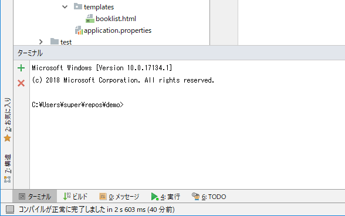
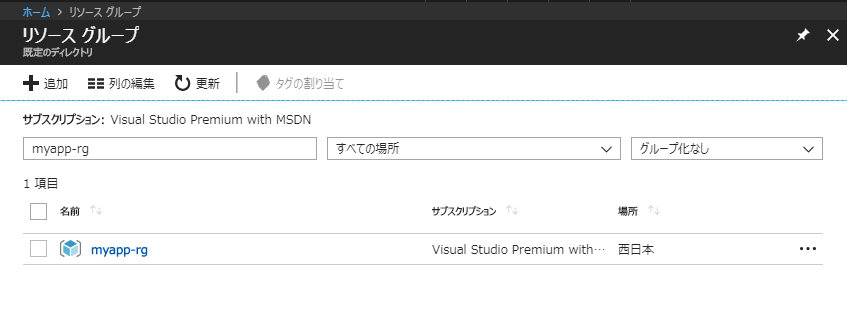
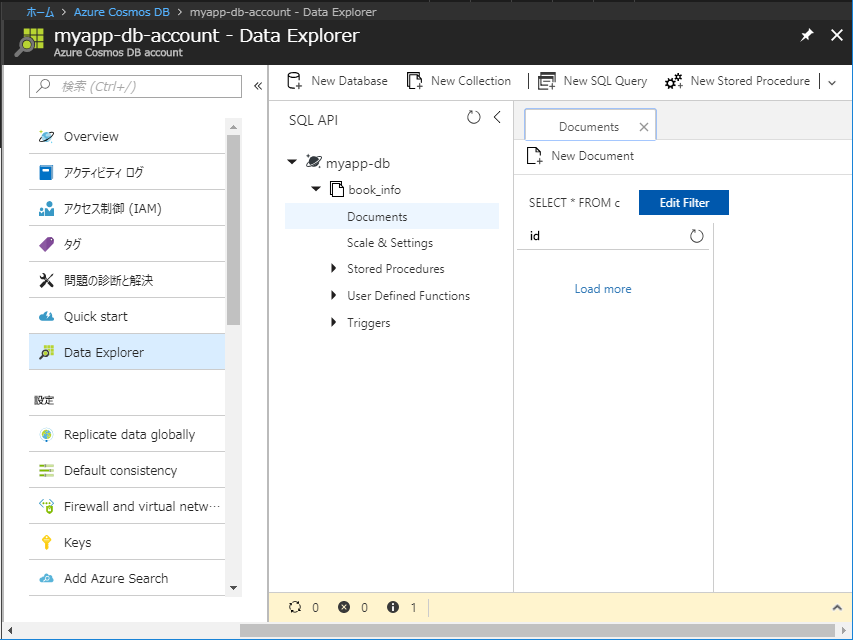

# Azure Cosmos DBの準備

本章では、Azure Cosmos DBの準備を行います。

# Azure CLIでのログイン

本章では、Azure CLIを使用して作業を行いますが、最初にAzure CLIを用いて
ログイン処理をしておく必要があります。

Azure CLIでのログインは、コマンドプロンプトから、以下のコマンドを用いて行います。

```
C:\Users\super\repos\demo>az login
```

上のコマンドを実行すると、コマンドプロンプトに

```
To sign in, use a web browser to open the page https://microsoft.com/devicelogin and enter the code XXXXXXXXX to authenticate.
```

のように表示されます。出力内容の通り、ブラウザーで
[https://microsoft.com/devicelogin](https://microsoft.com/devicelogin)
にアクセスし、表示されているコード（上の場合は「XXXXXXXXX」ですが、実行の度に
変わります）を入力し、画面に表示される内容を確認し、問題がなければ
「続行」ボタンを押します。

すると、
「Microsoft Azure Cross-platform Command Line Interfaceにサインインしようとしています。」
というメッセージが表示され、サインインが求められますので、Azureサブスクリプションと
関連づけられたアカウント情報を入力してください。

サインインに成功すると、ブラウザー画面に
「デバイスの Microsoft Azure Cross-platform Command Line Interface アプリケーションにサインインしました。このウィンドウは閉じてかまいません。」
というメッセージが表示さますので、ブラウザーは閉じてかまいません。

また、しばらくすると、コマンドプロンプトに処理結果を表すJSONが表示されます。

# リソースグループの作成

まずは、今回のアプリケーションで使用するリソースグループを作成します。
リソースグループはAzureポータル（Web画面）からも作成できますが、今回は
Azure CLIで作成します。

Azure CLIのコマンドは、コマンドプロンプトで直接入力して実行することが
できますが、ここではバッチファイルを作成して実行することにします。

1. 最初にCosmos DB関連のAzure CLIスクリプトを配置するフォルダを作成する。
IntelliJ IDEAのプロジェクトウィンドウで、「demo」を右クリックし、
「新規＞ディレクトリー」を選び、ディレクトリー名「cosmosdb」を入力する。

1. 次に「cosmosdb」を右クリックし、「新規＞ファイル」を選び、
新規ファイル名「01_create_rg.bat」を入力する。

1. 作成したファイルに、以下の内容を入力する。

    ```
    az group create --name myapp-rg --location japanwest
    ```
    
    このコマンドを実行すると、「西日本」リージョンに「myapp-rg」という
    名前のリソースグループが作成される。

1. IntelliJ IDEAのターミナルを使用して、作成したバッチファイルを実行する。

   1. 画面下部の「ターミナル」を押して、ターミナルウィンドウを表示する。
       
       
       
   1. ターミナルウィンドウで以下の通り入力し、作成したバッチファイルを実行する。
   
       ```
       C:\Users\super\repos\demo>cd cosmosdb
       
       C:\Users\super\repos\demo\cosmosdb>01_create_rg.bat
       ```

       正常に終了すると、「"provisioningState": "Succeeded"」を含む
       JSONがターミナルウィンドウに表示される。

   1. （参考）[Azureポータル](https://portal.azure.com/)にログインし、
   左ペインで「リソース グループ」を選択すると、上で追加したリソース
   グループが登録されていることがわかる。
   
   
   
# SQL APIアカウントを作成する。

1. 上と同様、「cosmosdb」フォルダに「02_create_sql_api_account.bat」ファイルを作成する。

1. 作成したファイルに、以下の内容を入力する。ただし、
「set sql_api_account=」の後に指定する値（アカウントID）は、
これがDNS名として使用され、全世界で一意になるよう指定する必要があるため、
各自異なる値とすること。

    ```
    set rg_name=myapp-rg
    set sql_api_account=myapp-db-account
    
    az cosmosdb create ^
     -n %sql_api_account% ^
     --kind GlobalDocumentDB ^
     -g %rg_name%
    
    ```

1. 作成したバッチファイルを実行する。
        
    このコマンドを実行すると、Cosmos DBのSQL APIアカウントが作成される。
    Cosmos DBは複数のAPIを用いて使用することができるが、ここで作成したのは
    SQL APIを使用するアカウントである。
    
    正常に終了すると、「"provisioningState": "Succeeded"」を含む
    JSONがターミナルウィンドウに表示される。
    
# データベースを作成する

1. これまで同様、「cosmosdb」フォルダに「03_create_database.bat」ファイルを作成する。

1. 作成したファイルに、以下の内容を入力する。sql_api_accountの値は、
上で指定した値とすること。

    ```
    set rg_name=myapp-rg
    set sql_api_account=myapp-db-account
    set db_name=myapp-db
    
    az cosmosdb database create ^
     -n %sql_api_account% ^
     -g %rg_name% ^
     --db-name %db_name%
    ```
1. 作成したバッチファイルを実行する。
    
    正常に終了すると、これまで同様、JSONが表示される。
    ただし、今回は「"provisioningState": "Succeeded"」は表示されない。

# コレクションを作成する。

Cosmos DBでデータを保持する実体となるコレクションを作成します。

1. これまで同様、「cosmosdb」フォルダに「04_create_collection.bat」ファイルを作成する。

1. 作成したファイルに、以下の内容を入力する。sql_api_accountの値は、
上で指定した値とすること。

    ```
    set rg_name=myapp-rg
    set sql_api_account=myapp-db-account
    set db_name=myapp-db
    set collection=book_info
    
    az cosmosdb collection create ^
     --collection-name %collection% ^
     -n %sql_api_account% ^
     -g %rg_name% ^
     --db-name %db_name%
    ```
1. 作成したバッチファイルを実行する。
    
    正常に終了すると、作成したコレクションの情報を含むJSONが表示される。
    
1. （参考）Azure Portalの「Cosmos DB＞Data Explorer」で見ると、
以下の通りデータベース（myapp-db）およびコレクション（book_info）が
作成されているのがわかる。

    
