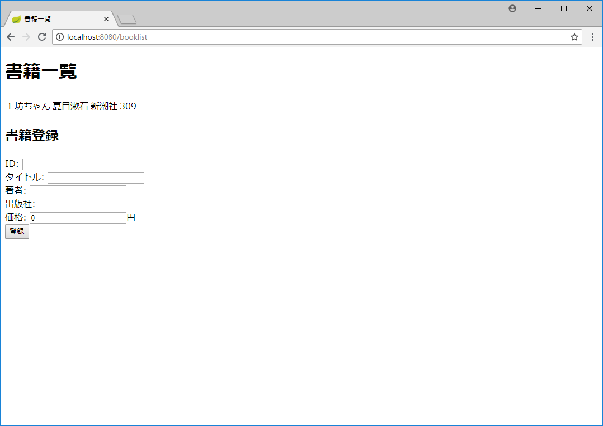
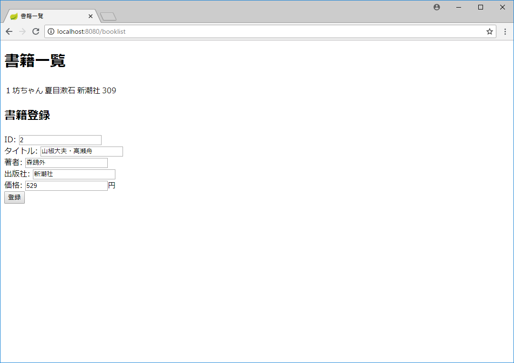

# 簡単なWebページを作る

本章では、簡単なWebページを作り、Spring Bootアプリケーションに組み込みます。
以下、書籍情報の一覧表示と登録ができるアプリケーションの作成を行います。

# Thymeleafテンプレートの作成

Spring Bootでは、Thymeleafのテンプレートを使ってWebページを作成します。

1. 「src/main/resources/templates」フォルダの下に「booklist.html」ファイルを作成する。

    プロジェクトウィンドウでtemplatesフォルダを右クリックし、「新規＞ファイル」を
    選び、ファイル名「booklist.html」を入力して「OK」を押す。

1. booklist.htmlファイルに、以下の内容を入力する。

    ```
    <!DOCTYPE html>
    <html xmlns:th="http://www.thymeleaf.org">
    <head>
        <meta charset="UTF-8"/>
        <title>書籍一覧</title>
    </head>
    
    <body>
    <h1>書籍一覧</h1>
    <table>
        <tr th:each="book : ${bookList}">
            <td th:text="${book.id}">0</td>
            <td th:text="${book.title}">あああ</td>
            <td th:text="${book.author}">いいい</td>
            <td th:text="${book.publisher}">ううう</td>
            <td th:text="${book.price}">9999</td>
        </tr>
    </table>
    
    <h2>書籍登録</h2>
    <form th:action="@{/booklist/register}" th:object="${bookListForm}" method="post">
        <label for="id">ID: </label>
        <input type="text" id="id" name="id" th:field="*{id}" th:errorClass="error-input"/><br/>
        <label for="title">タイトル: </label>
        <input type="text" id="title" name="title" th:field="*{title}" th:errorClass="error-input"/><br/>
        <label for="author">著者: </label>
        <input type="text" id="author" name="author" th:field="*{author}" th:errorClass="error-input"/><br/>
        <label for="publisher">出版社: </label>
        <input type="text" id="publisher" name="publisher" th:field="*{publisher}" th:errorClass="error-input"/><br/>
        <label for="price">価格: </label>
        <input type="text" id="price" name="price" th:field="*{price}" th:errorClass="error-input"/>円<br/>
        <input type="submit" value="登録"/>
    </form>
    
    </body>
    </html>
    ```

1. モデルクラスの作成

    書籍情報を保持するモデルBookInfoクラスを作成します。

   1. プロジェクトウィンドウで「com.example.demo」を右クリックし、
   「新規＞パッケージ」を選び、パッケージ名「model」を入力して「OK」を押す。
   
   1. プロジェクトウィンドウで「model」を右クリックし、「新規＞Javaクラス」
   を選び、名前「BookInfo」を入力して「OK」を押す。
   
   1. BookInfo.javaファイルに、以下の内容を入力する。
   
    ```
    package com.example.demo.model;
    
    public class BookInfo {
    
        public BookInfo() {
        }
    
        public BookInfo(String id, String title, String author, String publisher, int price) {
            this.id = id;
            this.title = title;
            this.author = author;
            this.publisher = publisher;
            this.price = price;
        }
    
        private String id;
    
        private String title;
    
        private String author;
    
        private String publisher;
    
        private int price;
    
        public String getId() {
            return id;
        }
    
        public void setId(String id) {
            this.id = id;
        }
    
        public String getTitle() {
            return title;
        }
    
        public void setTitle(String title) {
            this.title = title;
        }
    
        public String getAuthor() {
            return author;
        }
    
        public void setAuthor(String author) {
            this.author = author;
        }
    
        public String getPublisher() {
            return publisher;
        }
    
        public void setPublisher(String publisher) {
            this.publisher = publisher;
        }
    
        public int getPrice() {
            return price;
        }
    
        public void setPrice(int price) {
            this.price = price;
        }
    
        @Override
        public String toString() {
            return String.format("BookInfo[id=%s, title=%s, author=%s, publisher=%s, price=%d]",
                    id, title, author, publisher, price);
        }
        
    }
    ```

1. フォームクラスの作成

    書籍情報登録時のフォームデータを表すクラスを作成します。

   1. プロジェクトウィンドウで「com.example.demo」を右クリックし、
   「新規＞パッケージ」を選び、パッケージ名「web」を入力して「OK」を押す。
   
   1. プロジェクトウィンドウで「web」を右クリックし、「新規＞Javaクラス」
   を選び、名前「BookListForm」を入力して「OK」を押す。
   
   1. BookListForm.javaファイルに、以下の内容を入力する。

    ```
    package com.example.demo.web;
    
    public class BookListForm {
    
        private String id;
    
        private String title;
    
        private String author;
    
        private String publisher;
    
        private int price;
    
        public String getId() {
            return id;
        }
    
        public void setId(String id) {
            this.id = id;
        }
    
        public String getTitle() {
            return title;
        }
    
        public void setTitle(String title) {
            this.title = title;
        }
    
        public String getAuthor() {
            return author;
        }
    
        public void setAuthor(String author) {
            this.author = author;
        }
    
        public String getPublisher() {
            return publisher;
        }
    
        public void setPublisher(String publisher) {
            this.publisher = publisher;
        }
    
        public int getPrice() {
            return price;
        }
    
        public void setPrice(int price) {
            this.price = price;
        }
        
        @Override
        public String toString() {
            return String.format("BookInfo[id=%s, title=%s, author=%s, publisher=%s, price=%d]",
                    id, title, author, publisher, price);
        }
        
    }
    ```

1. コントローラークラスの作成

    書籍情報登録時のフォームデータを表すクラスを作成します。
    なお、現時点では、一覧表示処理ではダミーデータを返却し、
    登録処理ではデータベースに登録するかわりにログに内容を
    出力するようにします。

   1. プロジェクトウィンドウで「com.example.demo」を右クリックし、
   「新規＞パッケージ」を選び、パッケージ名「web」を入力して「OK」を押す。
   
   1. プロジェクトウィンドウで「web」を右クリックし、「新規＞Javaクラス」
   を選び、名前「BookListForm」を入力して「OK」を押す。
   
   1. BookListForm.javaファイルに、以下の内容を入力する。
    
    ```
    package com.example.demo.web;
    
    import com.example.demo.model.BookInfo;
    import org.slf4j.Logger;
    import org.slf4j.LoggerFactory;
    import org.springframework.stereotype.Controller;
    import org.springframework.ui.Model;
    import org.springframework.validation.BindingResult;
    import org.springframework.web.bind.annotation.GetMapping;
    import org.springframework.web.bind.annotation.ModelAttribute;
    import org.springframework.web.bind.annotation.PostMapping;
    import org.springframework.web.bind.annotation.RequestMapping;
    
    import java.util.ArrayList;
    import java.util.List;
    
    @Controller
    @RequestMapping("/booklist")
    public class BookListController {
        
        private static final Logger LOGGER = LoggerFactory.getLogger(BookListController.class);
        
        @ModelAttribute
        BookListForm setUpForm() {
            return new BookListForm();
        }
        
        @GetMapping
        public String getAllBookInfo(Model model) {
            List<BookInfo> bookList = new ArrayList<>();
            
            BookInfo book = new BookInfo("1", "坊ちゃん", "夏目漱石", "新潮社", 309);
            bookList.add(book);
    
            model.addAttribute("bookList", bookList);
            
            return "booklist";
        }
        
        @PostMapping(path = "register")
        public String registerBookInfo(BookListForm form, BindingResult result, Model model) {
            LOGGER.info(form.toString());
            
            return "redirect:/booklist";
        }
    }
    ```

1. アプリケーションの実行と動作確認

    ここまでで、アプリケーションを実行して、Webページを表示することができます。

    1. アプリケーションの開始
    
    アプリケーションは、前章と同様、DemoApplication.main()で開始します。
    前回同様、アプリケーションが起動すると、実行ウィンドウに以下のログが
    出力されます。

    ```
    2018-06-02 14:24:40.690  INFO 7680 --- [           main] com.example.demo.DemoApplication         : 
    Started DemoApplication in 9.909 seconds (JVM running for 8.151)
    ```

    1. ブラウザーで一覧表示画面を開く
    今回は、上で作成したテンプレートを使って書籍情報を表示するため、
    ブラウザーでは「http://localhost:8080/booklist/」を開きます。
    
    以下の画面が表示されれば成功です。
    
    

    1. 書籍情報の登録を行う。
    
    以下の通り画面に入力し、「登録」ボタンを押します。
    
    
    
    現時点では、データベースへの登録処理は未実装ですが、上に書いた通り、
    ログに内容を出力します。以下のような内容がログに出力されれば成功です。

    ```
    2018-06-02 14:30:30.103  INFO 4884 --- [nio-8080-exec-8] com.example.demo.web.BookListController  : 
    BookInfo[id=2, title=山椒大夫・高瀬舟, author=森鴎外, publisher=新潮社, price=529]
    ```
    
    一覧表示では固定のダミーデータしか返さないため、ブラウザーの画面上は、
    最初の表示時と同じで、登録しようとしたデータは表示されません。

1. ここまで問題なく動作していれば、いったんアプリケーションを停止する。
アプリケーションの停止は、前章同様、IntelliJ IDEAの実行ウィンドウで、
停止ボタン（赤い四角）を押して行う。

