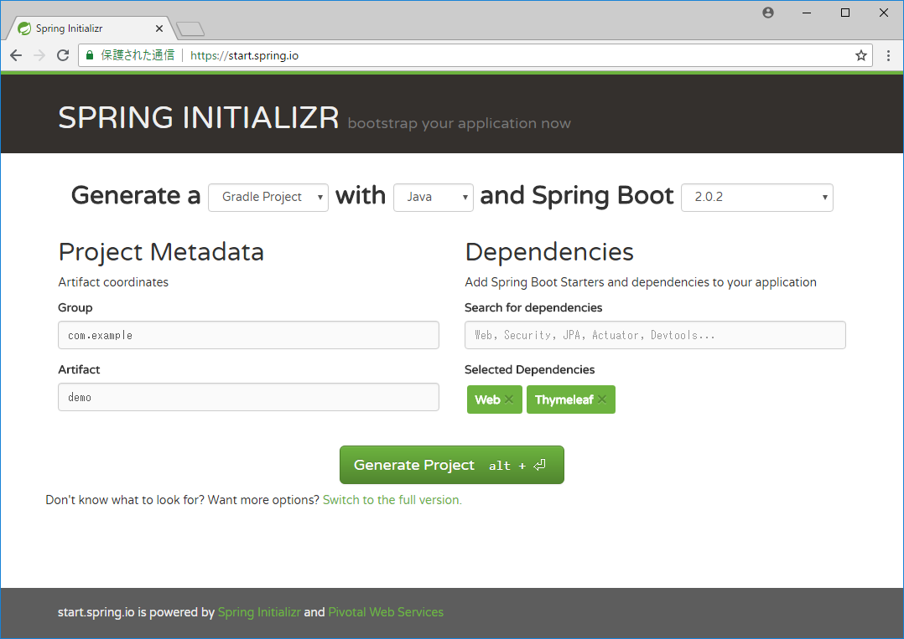
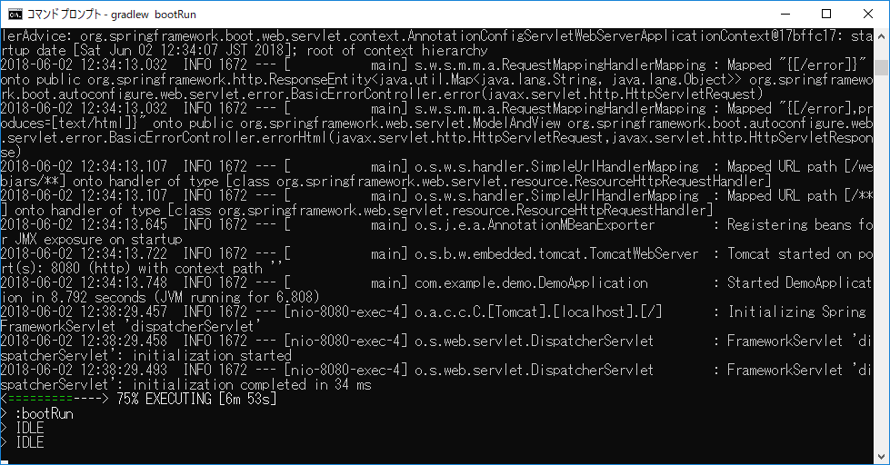
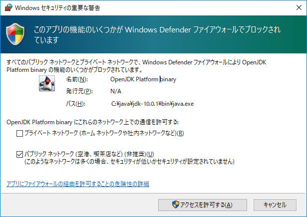
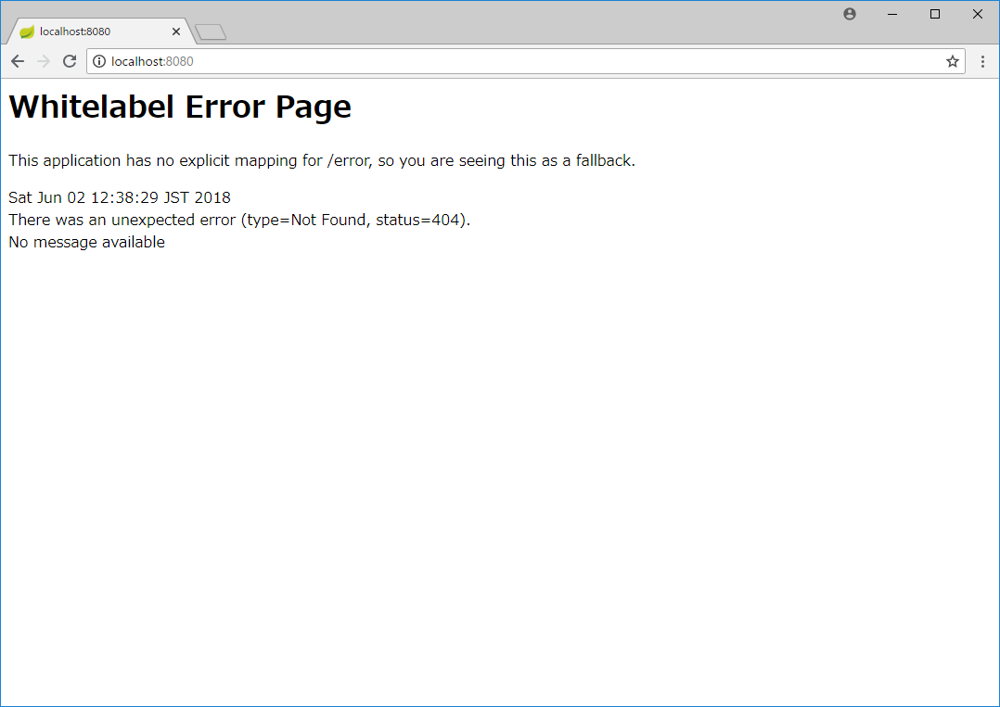

# Spring Bootプロジェクトの作成

# Spring InitializrでGradleプロジェクトファイルを生成する

Spring Bootでは、Spring InitializrというWebページを使うことで、
使用する言語、ビルドツール、Spring Bootバージョン、ライブラリーなどが
指定されたビルドスクリプトを生成してダウンロードすることができます。

1. ブラウザーで[Spring Initializr](https://start.spring.io/)を開く。
1. 以下の通り値を設定して、「Generate Project」ボタンを押す。
   - Generate a [Gradle Project] with [Java] and Spring Boot [2.0.2]
   - Group: com.example
   - Artifact: demo
   - Dependencies: Web, Thymeleaf
   
   （注）変更点は「Maven Project」を「Gradle Project」にする点と、
   Dependenciesに「Web」「Thymeleaf」を追加する点。
   Dependenciesの追加は、「Search for Dependencies」欄に「Web」などと
   入力しEnterボタンを押して確定するとできる。
   なお、Spring Bootのバージョンはタイミングにより変わると思うが、
   2系列のバージョンがデフォルトで選択されていると思うので、そのままでよい。
   


# ダウンロードしたGradleプロジェクトを展開する

Spring InitializrからダウンロードしたZIPファイルを「C:\Users\xxxxx\repos」
以下に展開します（xxxxxはユーザー名。reposフォルダは適宜作成してください）。

展開後、以下のような階層になっていることを確認してください。ZIPファイルの
展開先によっては、demoフォルダが二重になっている（...\demo\demo\gradle\...）
場合があるので、その場合は、中間のdemoフォルダを1つ削除してください。

```
C:\Users\xxxxx\repos
└─demo
    ├─gradle
    │  └─wrapper
    └─src
        ├─main
        │  ├─java
        │  │  └─com
        │  │      └─example
        │  │          └─demo
        │  └─resources
        │      ├─static
        │      └─templates
        └─test
            └─java
                └─com
                    └─example
                        └─demo
```

# Gradleプロジェクトの動作確認

ここでは、ダウンロードして展開したGradleプロジェクトが正しく動作することを
確認します。

1. コマンドプロンプトを開く
1. 「C:\Users\xxxxx\repos\demo」に移動する

    ```
    C:\Users\xxxxx> cd C:\Users\xxxxx\repos\demo
    ```

1. GradleラッパーでbootRunを実行する。

    ```
    C:\Users\xxxxx\repos\demo> gradlew bootRun
    ```

1. しばらく待ち、コマンドプロンプトに以下の表示が出るのを確認する（表示の折り返し位置は画面の右端のため、画面幅によって異なる）。

    ```
    2018-06-02 12:34:13.748  INFO 1672 --- [           main] com.example.demo.DemoApplication         : 
    Started DemoApplication in 8.792 seconds (JVM running for 6.808)
    ```

    
    
    ※初回実行時は、Gradleのダウンロード、依存ライブラリーのダウンロードが
    行われるため、表示れるまでに時間がかかります。
    
    ※「このアプリの機能のいくつかがWindows Defenderファイアウォールで
    ブロックされています」という画面が表示された場合、以下の内容であることを
    確認して「アクセスを許可する」ボタンを押してください。
    
    - 名前: OpenJDK Platform binary
    - 発行元: N/A
    - パス: C:\java\jdk-10.0.1\bin\java.exe
    
    

1. ブラウザーで [http://localhost:8080/](http://localhost:8080/) を開く。

1. 以下の画面（Whitelabel Error Page）が表示されることを確認する。

    

1. コマンドプロンプトでCtrl-Cを教して、Gradleを終了する。
「バッチ ジョブを終了しますか (Y/N)?」と表示された場合、Yを入力する。

